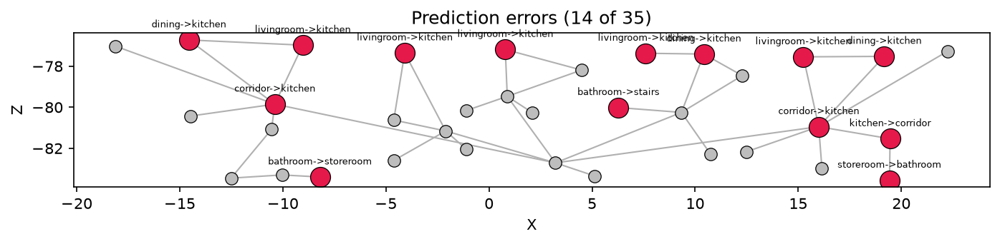
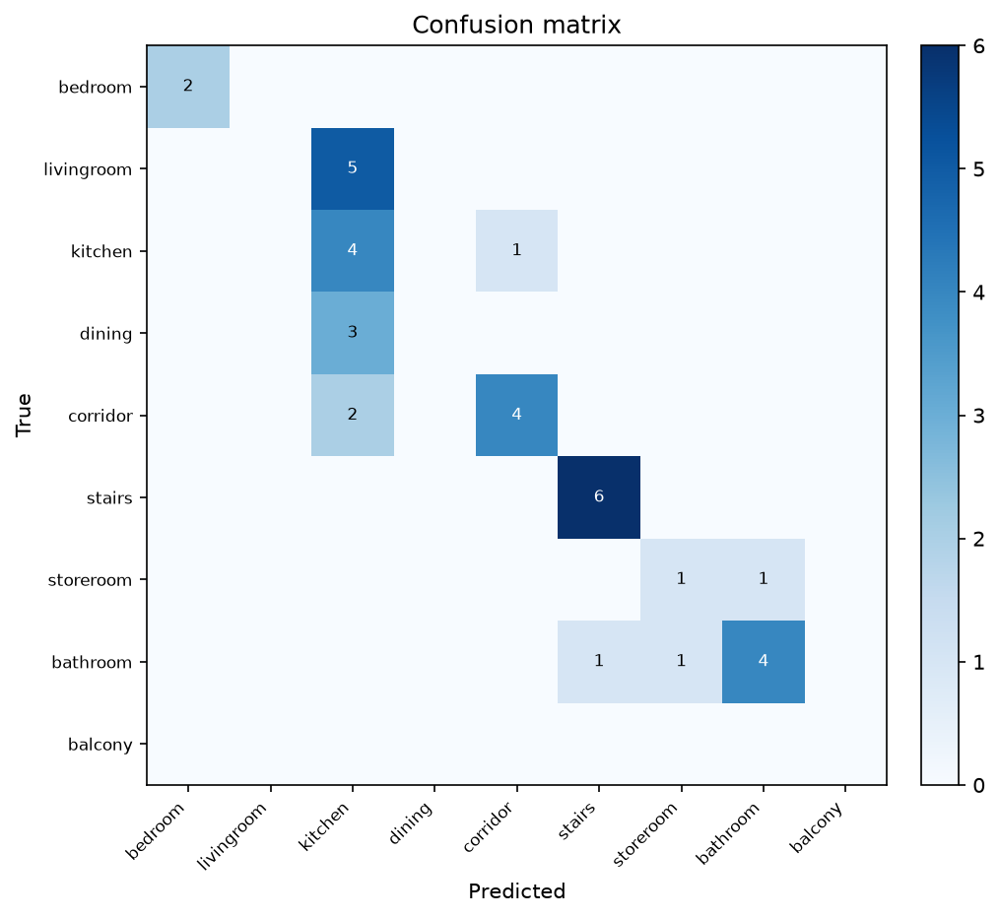

# Habitar 7.2 - Node Classification Interpretation

## Method

The room graph represents spaces as nodes and doors/passages as edges. The
pretrained MSD node classifier predicts one of nine room classes using zoning
and connectivity features. The comparison uses the 35 manually assigned room
labels as ground truth.

## Overall result

- Correct predictions: 21 of 35.
- Accuracy for this case: 60.0%.
- Incorrect predictions: 14 of 35.

## Performance by class

| Class | Correct | Total | Accuracy |
|---|---:|---:|---:|
| Bedroom | 2 | 2 | 100.0% |
| Living room | 0 | 5 | 0.0% |
| Kitchen | 4 | 5 | 80.0% |
| Dining | 0 | 3 | 0.0% |
| Corridor | 4 | 6 | 66.7% |
| Stairs | 6 | 6 | 100.0% |
| Storeroom | 1 | 2 | 50.0% |
| Bathroom | 4 | 6 | 66.7% |

## Main prediction patterns

The strongest result is the recognition of stairs and bedrooms. Their graph
positions and connectivity patterns appear sufficiently distinctive for the
pretrained model.

The main confusion is between open living functions and kitchens:

- All five living rooms were predicted as kitchens.
- All three dining rooms were predicted as kitchens.
- The model therefore predicted 14 kitchens although only five exist.

This is spatially plausible as a model failure: living, dining and kitchen
spaces in the duplex units belong to the same dynamic zone and can have very
similar numbers and types of connections. The feature schema describes
topological relationships more strongly than dimensions, furniture, enclosure
or program-specific geometry.

Service spaces remain partly ambiguous: one storeroom was predicted as a
bathroom and one bathroom as a storeroom, both small terminal spaces. One
bathroom was read as stairs, one kitchen as a corridor and two corridors as
kitchens, showing that distributor and service spaces with similar local
connectivity are still confused.

## Architectural interpretation

### Accessibility and circulation

`Corridor_002` remains the common circulation hub. The room graph shows that
private units connect through a shared distributor rather than directly to one
another. This supports the reading of a longitudinal collective circulation
system serving the five duplex units.

### Apartment organization

The graph contains repeated local structures around living, kitchen, dining,
bathroom and stair nodes. Those repetitions make the apartments legible as
families of similar subgraphs, but also explain why the classifier confuses
rooms with comparable neighbourhoods.

### Spatial hierarchy

Corridors and stairs form the principal hierarchical structure because they
organize movement between common and private zones. Bedrooms, bathrooms and
storerooms generally occupy terminal or low-degree positions.

### Classification limitations

The model was trained on MSD examples whose room proportions, door conventions
and adjacency patterns may differ from this Habitar 7.2 reinterpretation. The
60.0% result should therefore be interpreted as evidence of partial transfer,
not as a failure to complete the task. The assignment objective is met by
explaining where the pretrained model generalizes and where architectural
differences produce errors.

## Presentation conclusion

The graph representation successfully exposes circulation hierarchy and room
relationships, while the prediction experiment demonstrates that connectivity
alone distinguishes some programs very well (`stairs`, `bedroom`) but is not
enough to separate open-plan living, dining and kitchen functions. A stronger
future model could include room area, aspect ratio, facade contact, apartment
membership and geometric position in addition to adjacency features.
