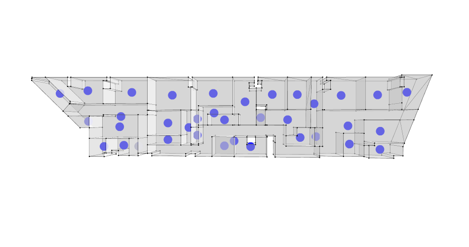
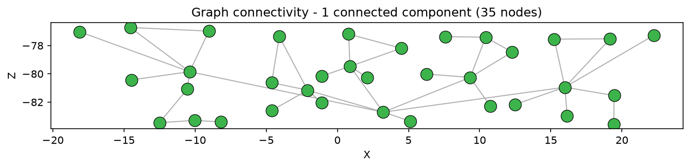
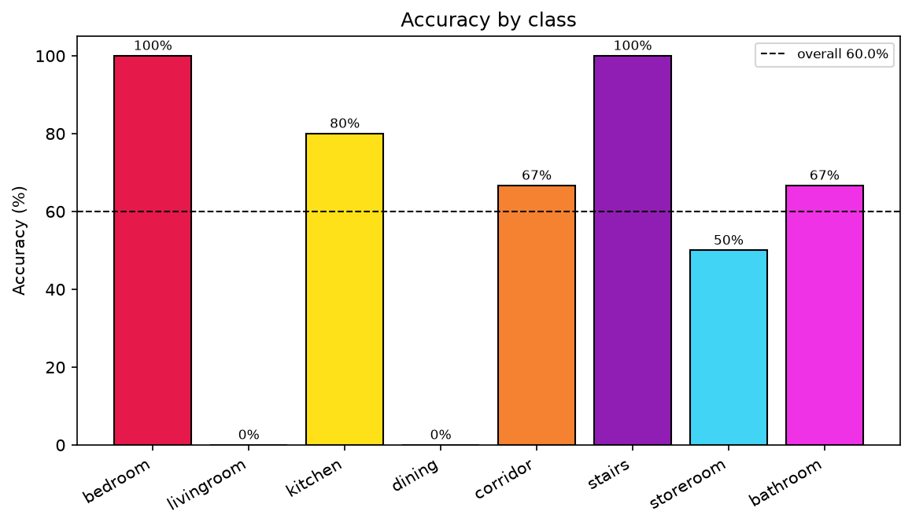

# Habitar 7.2 — Graph Machine Learning of an Architectural Floor Plan

Final assignment for the Graph Machine Learning course. Starting from a recreated
residential floor plan (**Habitar 7.2**, level L01), the project turns architecture
into a **graph** — rooms become nodes, doors/passages become edges — then analyzes
its spatial structure and uses a **pretrained Graph Neural Network** (trained on the
*Modified Swiss Dwellings* dataset) to classify each room by type.

The work is organized as the five stages of the assignment brief, each in its own
folder. This README summarizes **all five**; see
[README_PROJECT_FLOW.md](README_PROJECT_FLOW.md) for the file-by-file flow.


## Results at a glance

| Metric | Value |
|---|---|
| Room graph | **35 nodes**, **39 edges**, **1 connected component** |
| Node classification (pretrained MSD model) | **60 % accuracy** (21 / 35) |
| Best-recognized classes | bedroom & stairs (100 %) |
| Hardest classes | living room & dining (0 %) — both predicted as *kitchen* |

---

## Stage 1 — Research: dataset & references
📁 `01_Research_Dataset_and_References`

Study of the **Modified Swiss Dwellings (MSD)** dataset and the graph-learning
references that frame the task (representing buildings as graphs, room-type node
classification). This grounds the feature schema and the nine room classes used later.

**Deliverable:** [research PDF on MSD building-graph prediction](01_Research_Dataset_and_References/dataset%20and%20reference%20research_MSD%20Building%20Graph%20Prediction%20%281%29.pdf).

## Stage 2 — Recreate the floor plan
📁 `02_Recreate_Floor_Plan`

The Habitar 7.2 level L01 plan was rebuilt from scratch as clean 3D geometry — room
volumes, doors, windows and passages — and exported as **OBJ** (`Assets2.0/`) together
with the source **Rhino** files. Living room and dining were modelled as separate
volumes, and the bedroom unit was reconnected by adding the missing door **`Door_006A`**
(`Room_001 ↔ Store_Room_001`).

**Deliverables:** corrected OBJ assets (`Assets2.0/`), Rhino files, floor-plan renders.

## Stage 3 — Build the room graph
📁 `03_Build_Graph_Representation` · notebook `S06-15A`

Using **`topologicpy`**, room volumes become *cells* and doors/windows become *aperture
faces*; two rooms that share an aperture get an edge. This yields the **room graph
(35 nodes, 39 edges, 1 connected component)** and a bipartite door–space graph, plus
schedules of every room and aperture.

**Deliverables:** `graph_outputs/habitar72_room_graph.json`, summary tables
(`tables/rooms_summary.csv`, `apertures_summary.csv`, `global_counts.csv`), graph images.



## Stage 4 — Spatial / graph analysis
📁 `04_Perform_Spatial_Graph_Analysis` · notebook `Graph ML -Spatial Intelligence`

A 0.5 m **navigation grid** is overlaid on the floor plate and sliced into a walkable
shell, from which navigation and analysis graphs are built. Space-syntax metrics are
then computed and mapped back onto the plan:

- **Shortest paths** (routing)
- **Closeness centrality / integration** — how accessible each space is
- **Betweenness centrality / choice** — how often a space lies on through-routes
- **Community detection** — clusters of strongly connected spaces
- **Degree centrality**

**Deliverables:** the analysis figures below + BREP exports in `outputs/`.

| Integration (closeness) | Community detection |
|---|---|
|  |  |

## Stage 5 — Node classification
📁 `05_Run_Node_Classification` · notebooks `S06-15B`, `S06-15C`

Each room is encoded with MSD-style node features (zoning + connectivity), exported as an
ML dataset, and fed to the **pretrained MSD Graph Neural Network**
(`pretrained_model/msd_node_classifier.pt`) to predict one of nine room types.

The model reaches **60 % accuracy**. It nails distinctive spaces (bedroom, stairs:
100 %) but collapses **living room / dining / kitchen** into "kitchen" (0 % for living
and dining) — because those rooms share the same zone and similar connectivity, so they
look identical to the model. Adding window *size* or room *area* as features would help;
see the [interpretation report](05_Run_Node_Classification/reports/02_node_classification_interpretation.md).

**Deliverables:** `ml_dataset/` CSVs, `predictions/`, `reports/` (ES/EN), figures.

| Graph connectivity | Accuracy by class |
|---|---|
|  |  |

---

## Run order (notebooks)

```text
1. 03_Build_Graph_Representation/notebooks/S06-15A Build Habitar 7.2 Room Graph.ipynb
2. 04_Perform_Spatial_Graph_Analysis/notebooks/.../Graph ML -Spatial Intelligence.ipynb
3. 05_Run_Node_Classification/notebooks/S06-15B Prepare Habitar 7.2 Graph.ipynb
4. 05_Run_Node_Classification/notebooks/S06-15C Predict Habitar 7.2 Nodes.ipynb
```

## Setup

Requires **Python 3.12** (avoid 3.14 — the pinned packages have no wheels for it yet).

```bash
python -m venv .venv
.venv\Scripts\activate        # Windows  (macOS/Linux: source .venv/bin/activate)
pip install -r requirements.txt
```

Run the notebooks in order (`Restart Kernel → Run All`) or headless with
`jupyter nbconvert --to notebook --execute --inplace "<notebook>.ipynb"`.

> `torch` / `torch_geometric` wheels are platform-specific. If install fails, use the
> official PyTorch index: https://pytorch.org/get-started.

## Reproducing the report figures

The deliverable figures and the presentation slide are generated **from the data**, so
they always match the pipeline:

```bash
python 05_Run_Node_Classification/generate_report_figures.py   # the 6 report figures
python 05_Run_Node_Classification/generate_slide2_image.py      # presentation slide 2
```

## Reports

In `05_Run_Node_Classification/reports/`: pipeline diagnostic, node-classification
interpretation, and the presentation summary/slides in **Spanish and English**.

## Notes

- **Connectivity fix:** the `Room_001` + `Bathroom_001` unit was originally disconnected
  (its only door was internal); door `Door_006A` reconnects it into a single 35-node graph.
- **Notebook 04** may intermittently crash the kernel at `Grid.EdgesByDistances`
  (an OpenCascade native instability, not a code bug) — just re-run it if it dies.

## Author

**David Agudelo** — IAAC. Built with `topologicpy` and the pretrained MSD node classifier.
